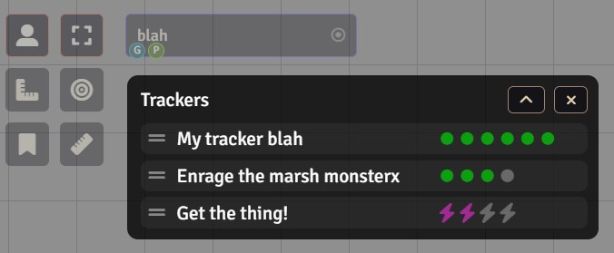
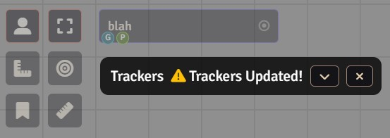

# Tictac Tracker for Foundry
A compact, collapsable overlay for consequence and progress trackers. 

 

Within the window, the GM can:
- add and delete trackers
- change tracker names, types, and visibility for players
- shrink and grow the number of 'pips' each tracker has
- increment and decrement each tracker
- re-order trackers with drag-handlebars (client-scoped)

In the module settings:
- change the icons (a font awesome string) used for progress and consequence trackers (client-scoped)
- change the font for the window (client-scoped)
- change the colors of 'pips' for progress and consequence trackers (client-scoped)

Other notes:
- new trackers are invisible to players when created (indicated by partial opacity in the GM view), allowing the GM to configure them before they're made visible
- when players have the window minimized (collapsed), a warning will show whenever a tracker is updated
- when the GM makes a tracker visible, the window is maximized (uncollapsed) so players are aware
- players can re-order their own trackers, but they can't change anything else about the trackers
- window is sized dynamically to fit tracker names and the number of 'pips' for a uniform look

  Player view:
  
  Collapsed:
  
  Player warning on tracker change (if collapsed):
  
  Quick-start guide:
  

